# Speed Safety Score — Complete Workflow & Methodology

> **ADB AI for Safer Roads 2026** · Thailand + Maharashtra, India · June 2026

---

## Table of Contents

1. [The Problem](#1-the-problem)
2. [The Data We Were Given](#2-the-data-we-were-given)
3. [Data We Added Ourselves](#3-data-we-added-ourselves)
4. [The Framework We Designed](#4-the-framework-we-designed)
5. [Speed Safety Score — Sub-score 1: Safe System Alignment](#5-sub-score-1--safe-system-alignment)
6. [Speed Safety Score — Sub-score 2: Limit Credibility Gap](#6-sub-score-2--limit-credibility-gap)
7. [Speed Safety Score — Sub-score 3: VRU Context Risk](#7-sub-score-3--vru-context-risk)
8. [Composing the Final SSS](#8-composing-the-final-sss)
9. [The Coverage Problem — ML Extension with XGBoost](#9-the-coverage-problem--ml-extension-with-xgboost)
10. [Priority Index — Where to Intervene First](#10-priority-index--where-to-intervene-first)
11. [Enrichment Layers](#11-enrichment-layers)
12. [Validation — No Crash Data Required](#12-validation--no-crash-data-required)
13. [Outputs](#13-outputs)
14. [Key Results](#14-key-results)
15. [Limitations & Honest Gaps](#15-limitations--honest-gaps)

---

## 1. The Problem

### What ADB Asked

The Asian Development Bank framing is precise and unusual:

> *"This is not about measuring whether drivers are speeding. It is about determining whether the current speed limit itself is appropriate for the road."*

This is a different question from anything most road safety tools answer. Most tools ask: **are drivers obeying the limit?** ADB asked: **should the limit even exist at that level?**

A road where 95% of drivers obey the 80 km/h limit can still be catastrophically dangerous — if that road runs through a school zone, serves heavy pedestrian traffic, or was designed for 50 km/h but was never reclassified. Compliance is not safety.

### Why This Matters

The Safe System framework, developed by the WHO and adopted by ADB, starts from a biological fact: the human body cannot survive a crash above a certain speed. That threshold depends on the type of impact:

| Collision type | Survivable speed |
|---|---|
| Pedestrian struck by vehicle | ~30 km/h |
| Side impact at intersection | ~50 km/h |
| Head-on rural road collision | ~70 km/h |
| Motorway with median barrier | ~100 km/h |

If a road exposes people to impact scenarios above these thresholds — because the posted limit is too high for the road's function — the limit itself is the problem. No amount of driver education or enforcement fixes a misaligned limit.

### The Specific Question We Answer

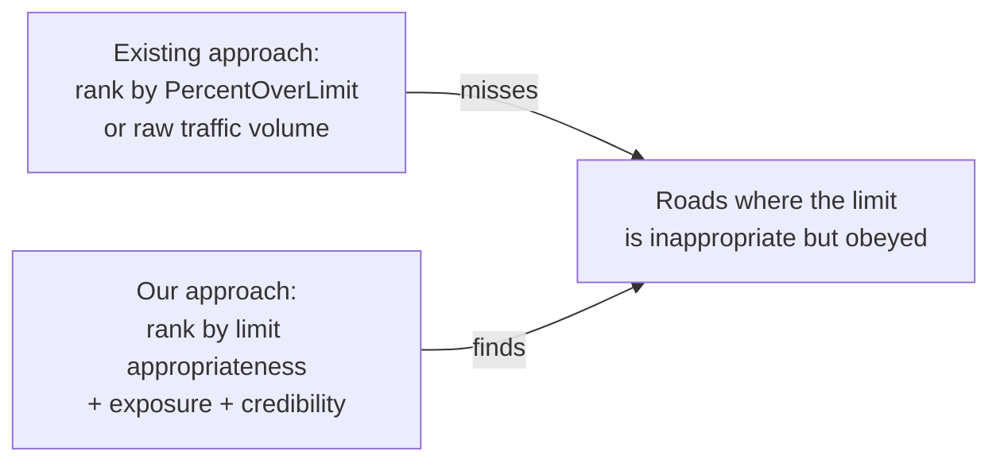

The roads that fall through the gap of conventional analysis are the ones we are specifically designed to find: a rural primary road that evolved into a de-facto market corridor, still posted at 80 km/h; a residential street reclassified to secondary without a limit change; a school-adjacent road with the same speed limit as the highway it feeds.

---

## 2. The Data We Were Given

The ADB challenge provided two core datasets. Everything else we sourced and added ourselves.

### 2.1 GPS Probe Data

This is the most valuable dataset. It comes from aggregated GPS traces — likely a combination of commercial fleet telematics and navigation app data — processed down to per-segment speed statistics.

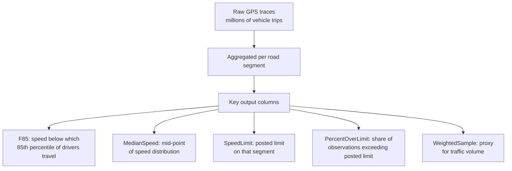

**What the F85 tells us:** The 85th percentile speed is the international standard for speed surveys. If F85 > SpeedLimit, it means the majority of drivers are already traveling faster than the limit — the limit has lost behavioral credibility. If F85 < SpeedLimit, the limit is either appropriate or conservative.

**Critical limitation:** Only **14,711 of 69,966 segments** (21%) have valid GPS probe data. The other 79% of the road network has no speed measurements — because probe data requires a minimum sample size to be statistically reliable, and many roads simply don't see enough instrumented vehicles.

### 2.2 Road Network Data

Geometric and functional attributes of each road segment, drawn from challenge data combined with OpenStreetMap.

| Column | What it means | Why we use it |
|---|---|---|
| `RoadClass` | motorway / trunk / primary / secondary / tertiary / residential | Determines Safe System threshold |
| `LandUse` | URBAN or RURAL | Urban roads have stricter thresholds |
| `IntersectionDensity` | count of junctions per km | Proxy for conflict-point risk |
| `SegmentLength` | metres | Exposure weighting in Priority Index |
| `ProvinceID` | Thailand province code | Geographic aggregation |
| `StreetImageLink` | Mapillary image URL for that segment | Field reference for analysts |

**What this tells us:** Road class and land use together define what safe speed looks like for a segment. A `secondary` road in `URBAN` context should not have the same limit as a `secondary` road in `RURAL` context — the people and conflict types are fundamentally different.

### 2.3 What Was NOT Given

Understanding what we did not have is as important as understanding what we did:

- **No crash data.** There is no record of accidents, fatalities, or injuries on any segment. Our model cannot be validated against actual outcomes. This is the central honest limitation of the entire submission.
- **No vehicle type breakdown.** We cannot distinguish car trips from motorcycle trips in the probe data.
- **No time-of-day split.** The F85 and MedianSpeed are averages over the full data collection period — we cannot see whether a road is dangerous specifically at school-run times.
- **No infrastructure condition survey.** We cannot tell from the data whether a road has guardrails, lighting, pedestrian crossings, or speed bumps.

---

## 3. Data We Added Ourselves

To assess VRU exposure, we needed to know who is near each road. None of this was in the challenge dataset — we sourced, processed, and merged it ourselves.

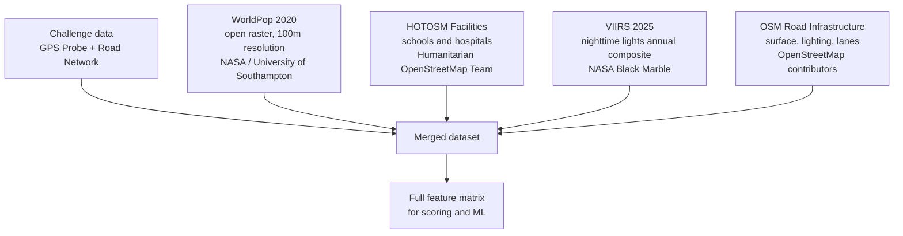

### WorldPop 2020

A gridded population density dataset at 100m resolution, covering all countries. For each road segment, we extract the population within a 500m buffer along the centreline. This gives us an estimate of how many people live or work immediately adjacent to the road — the most direct proxy for pedestrian and cyclist exposure we can compute without survey data.

### HOTOSM Facility Proximity

The Humanitarian OpenStreetMap Team maintains open datasets of schools and hospitals. For each segment, we compute whether any school or hospital falls within 300m. These are the locations where children, patients, and caregivers are most likely to be crossing roads on foot. A segment adjacent to a school has a categorically different VRU risk profile from a segment in an industrial zone.

### VIIRS 2025 Nighttime Lights

NASA's VIIRS satellite captures surface brightness at night. The 2025 annual composite gives us a stable measure of economic activity and population presence after dark. Segments in high-NTL zones are more likely to have nighttime pedestrian and motorcycle activity — markets, transport hubs, informal settlements — that GPS probe data (which skews toward daytime commercial traffic) may undercount. **5,487 segments (7.8% of the network) are flagged as high-NTL hotspots.**

### OSM Road Infrastructure

OpenStreetMap's road tags include surface type (paved / unpaved / gravel), presence of lighting, and lane count. These tell us about road condition beyond just functional class. A secondary road without lighting, on unpaved surface, is more dangerous than a secondary road with full infrastructure. **71.3% of segments have real-world OSM attributes; the remainder use class-level defaults.**

---

## 4. The Framework We Designed

### Why Two Separate Outputs

Early in our design, we faced a choice: produce one score that ranks all roads, or produce two outputs answering different questions. We chose two.

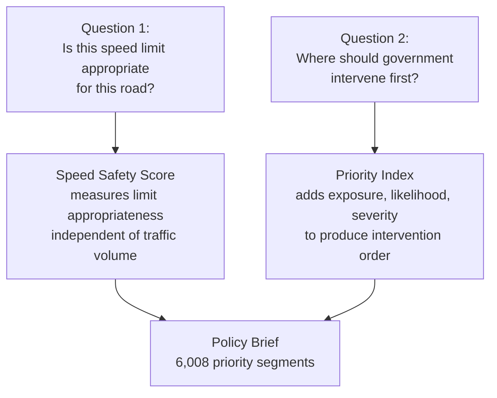

**Why not combine them?** A Critical SSS road in a remote area may have 200 vehicles per day. A High Risk SSS road through a dense urban market corridor may have 200,000. Combining them into one score would either bury the remote road (low traffic dominates) or surface it above more urgent urban interventions. Keeping them separate lets a government answer two genuinely different policy questions:

1. **Planning question:** Which roads have inappropriate limits? → SSS
2. **Budget question:** Given that we can fix 50 roads this year, which 50? → Priority Index

### Why Not Just Rank by PercentOverLimit

The naive approach — sort roads by the share of drivers exceeding the limit — answers "where is compliance lowest?" not "where is the limit wrong?" These two questions have very different answers.

A road where only 20% of drivers exceed the limit can still be Critical if the limit is 80 km/h in a school zone and the Safe System threshold is 30 km/h. Conversely, a road where 70% exceed the limit might be a rural motorway where the limit is artificially low and compliance has collapsed entirely — a credibility problem, not necessarily a risk problem.

Our SSS captures both failure modes. `PercentOverLimit` captures neither cleanly.

### Empirical Proof — The Hidden Danger Finding

We tested this directly on the 14,711 Tier 2 segments by plotting SSS against % vehicles over limit and dividing the space into four quadrants (SSS threshold: 45, % over limit threshold: 40%):

| Quadrant | Definition | Count | Share |
|---|---|---|---|
| **Hidden Danger** | SSS ≥ 45, % over limit < 40% | **5,021** | **34.1%** |
| Confirmed Danger | SSS ≥ 45, % over limit ≥ 40% | 1,822 | 12.4% |
| Safe | SSS < 45, % over limit < 40% | 5,907 | 40.2% |
| False Alarm | SSS < 45, % over limit ≥ 40% | 1,961 | 13.3% |

**Key finding:** Of all 6,843 high-risk segments (SSS ≥ 45), **73% fall in the Hidden Danger quadrant** — they would be deprioritised or missed entirely by any monitoring system that ranks roads by driver non-compliance. Drivers on these roads are largely compliant with a limit that is itself set wrong.

This is the core empirical validation of the methodology: SSS and PercentOverLimit are measuring different things, and the difference has operational consequences.

### Overall Architecture

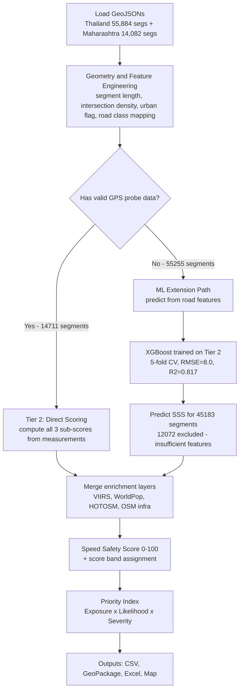

---

## 5. Sub-score 1 — Safe System Alignment

**Weight in final SSS: 38%**

### What It Measures

This sub-score measures how far the posted speed limit deviates from what the WHO Safe System framework says is survivable for the road context. It is entirely about the road's design and function — it does not look at how fast drivers actually travel.

### The Safe System Threshold Logic

The core insight of the Safe System framework is that different road contexts produce different impact scenarios. A pedestrian struck while crossing a road is in a fundamentally different crash than two cars colliding head-on on a motorway. Each scenario has a survivability threshold based on human biomechanics.

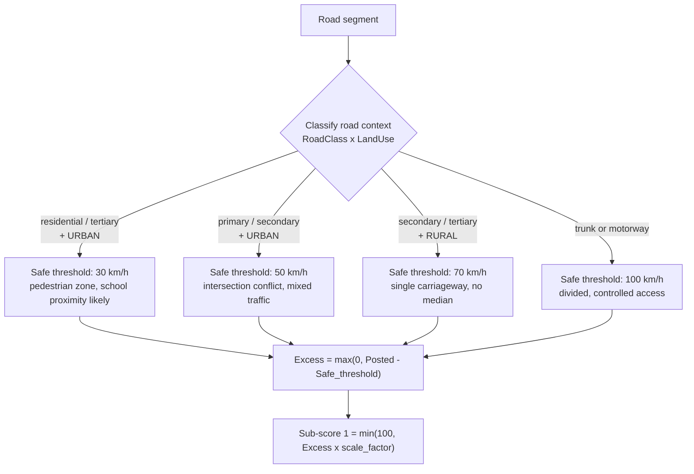

### Worked Examples

| Road | Class | Land Use | Safe Threshold | Posted Limit | Excess | Sub-score 1 |
|---|---|---|---|---|---|---|
| School-zone arterial | secondary | URBAN | 50 km/h | 80 km/h | 30 km/h | ~75 |
| Village connector | tertiary | RURAL | 70 km/h | 60 km/h | 0 | 0 |
| Urban motorway | motorway | URBAN | 100 km/h | 100 km/h | 0 | 0 |
| Market-street primary | primary | URBAN | 50 km/h | 90 km/h | 40 km/h | ~100 |

The scale factor is calibrated so that the maximum realistic excess (a residential road posted at 90 km/h) produces a score near 100, and a zero excess produces exactly 0.

### Why This Sub-score Matters Most

Sub-score 1 carries the highest weight (38%) because it is the most direct operationalisation of the challenge brief. ADB explicitly asked whether limits align with Safe System principles — that is exactly what this sub-score measures, anchored to WHO thresholds, with no assumptions about driver behaviour.

---

## 6. Sub-score 2 — Limit Credibility Gap

**Weight in final SSS: 30%**

### What It Measures

A speed limit that is routinely ignored is not just a compliance failure — it is a safety failure of a different kind. When the majority of drivers already exceed the limit, the limit provides no meaningful safety signal. Drivers negotiating the road in real time use the behaviour of surrounding traffic, not the posted sign, as their speed reference. The limit becomes invisible.

This sub-score measures whether the limit has lost behavioral credibility.

### The Credibility Threshold

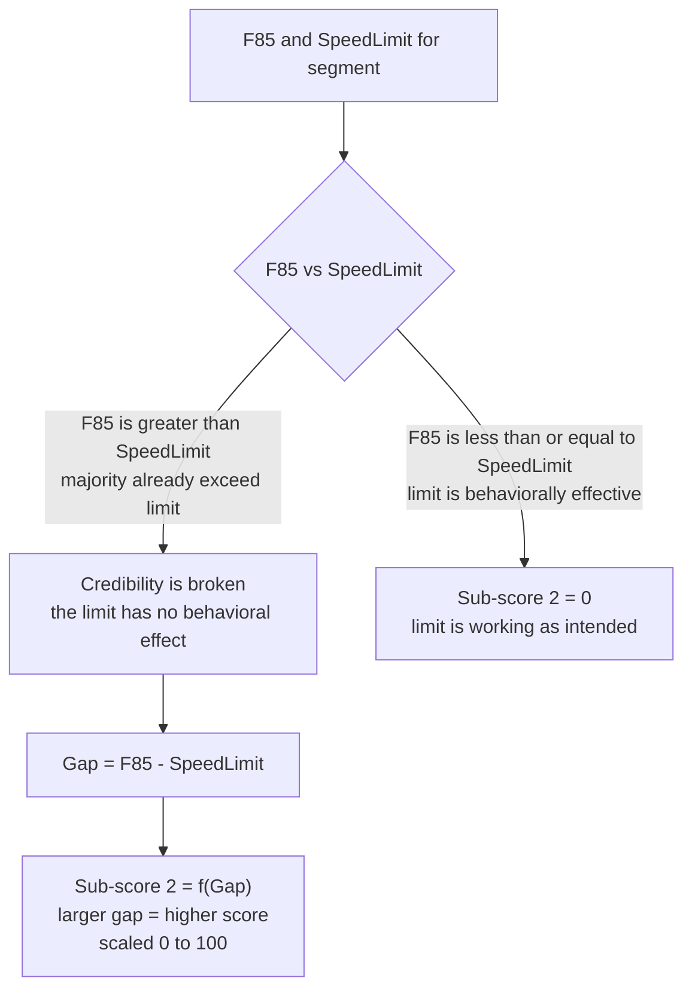

### Why the 85th Percentile

The F85 is the standard international metric for speed surveys because it represents the speed below which the large majority of cooperative, law-abiding drivers naturally travel. When F85 exceeds the posted limit, it means the limit is not just occasionally violated — it is being disregarded by the majority of drivers as a natural speed reference. The road has effectively self-regulated to a higher speed, and the posted sign no longer anchors behaviour.

### The Relationship Between Sub-scores 1 and 2

These two sub-scores can fire independently:

| Scenario | Sub-score 1 | Sub-score 2 | Interpretation |
|---|---|---|---|
| Urban road, 80 km/h posted, F85 = 65 km/h | High (limit too high) | Low (limit is obeyed) | Wrong limit but enforced |
| Rural road, 80 km/h posted, F85 = 95 km/h | Low (threshold = 70 km/h) | High (limit ignored) | Reasonable limit but collapsed |
| Urban road, 80 km/h posted, F85 = 90 km/h | High | High | Wrong limit AND ignored — most dangerous |
| Rural motorway, 110 km/h posted, F85 = 105 km/h | Low | Low | Appropriate limit, respected |

A segment can be Critical because of sub-score 1 alone (wrong limit for context), sub-score 2 alone (appropriate limit but behaviorally dead), or both simultaneously. The combination tells a richer diagnostic story than either alone.

---

## 7. Sub-score 3 — VRU Context Risk

**Weight in final SSS: 32%**

### What It Measures

The first two sub-scores describe the road in isolation. This sub-score asks: **who is near this road?** A 30 km/h excess on a remote industrial access road poses a different risk from the same excess outside a primary school. The people exposed to a misaligned limit determine how much the misalignment matters.

VRU stands for Vulnerable Road Users — specifically pedestrians, cyclists, and powered two-wheelers (PTWs). ADB's brief explicitly names PTWs as the primary concern in Asia-Pacific, where motorcycles and scooters dominate urban and peri-urban mobility.

### How We Measure VRU Exposure

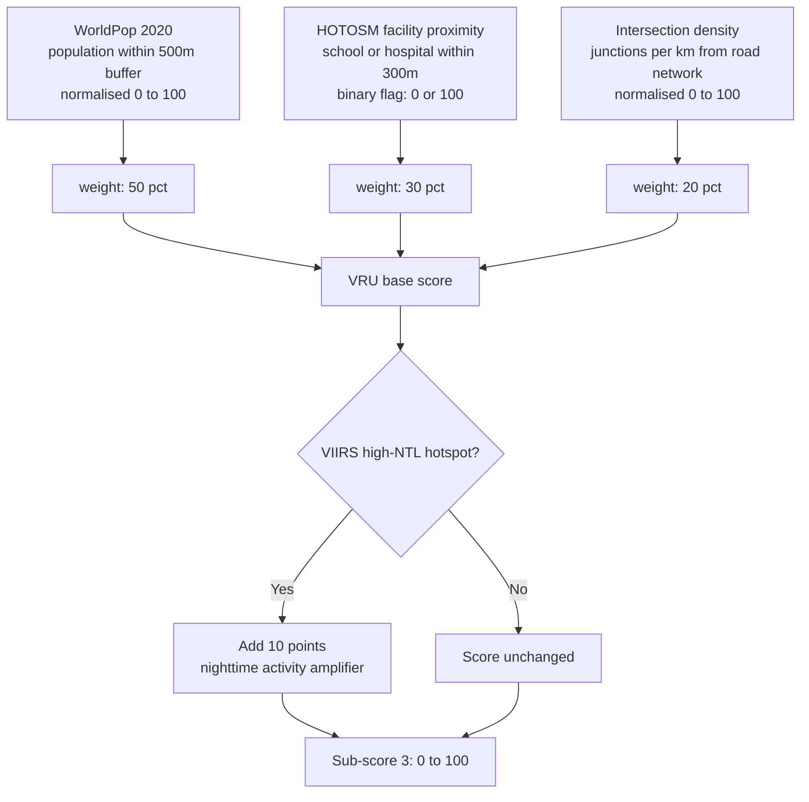

### Why Each Component — Scientific Basis

**Population density (50%)** is the primary signal. It directly measures the number of people who live and move near the road, which is the foundational exposure measure in any road safety analysis. This weight follows the WHO *Global Status Report on Road Safety* (2023) and iRAP's Safer Roads Investment Plans methodology, both of which treat pedestrian exposure volume as the primary determinant of VRU risk on a road corridor. A dense urban corridor with 50,000 residents within 500m has far higher VRU exposure than a peri-urban link with 2,000.

**Facility proximity (30%)** is a qualitative amplifier grounded in iRAP's Road Protection Score framework, which includes school zone proximity as an independent star-rating penalty. Schools and hospitals concentrate the most vulnerable pedestrians — children and patients — at predictable times and locations. The iRAP framework treats facilities within 300m as a binary high-vulnerability flag, which our implementation follows directly.

**Intersection density (20%)** captures conflict-point concentration, consistent with the AASHTO Highway Safety Manual (HSM, 2010) treatment of access points per kilometre as a primary crash frequency predictor. Every intersection introduces vehicle-pedestrian crossing events; higher density implies more VRU-vehicle conflict opportunities per unit of road length.

**VIIRS nighttime lights boost (+10 pts)** accounts for a gap in the GPS probe data: most commercial vehicle traces are daytime. High nighttime luminosity from markets, transport terminals, or dense informal settlements indicates VRU activity extends beyond daytime hours. The +10 point cap is intentionally modest — it is a contextual amplifier, not a dominant component.

**Sensitivity of VRU weights:** We tested 50/20/30 and 40/30/30 alternatives. Spearman correlation with baseline VRU sub-scores is ≥ 0.97 in both cases. The proxy validation below confirms that Critical-band roads show higher population exposure and nighttime activity than Acceptable-band roads under the current weights, consistent with what the components are intended to measure.

### Helmet Wearing Context

Thailand's helmet compliance rate is high (urban 79%, rural 67%). Maharashtra's is critically low (urban 24%, rural 15%). This means that on a segment with identical VRU sub-score, the real-world fatality risk for a motorcycle crash is dramatically higher in Maharashtra. We do not bake this into the formula (it would require per-segment PTW data we do not have), but it is an essential context for interpreting results across the two geographies.

---

## 8. Composing the Final SSS

### The Weighted Sum

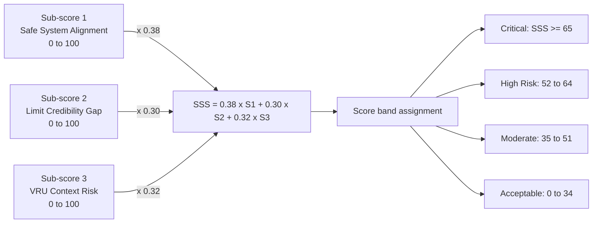

### Weight Rationale

The weights were set by engineering judgment against three criteria:

1. **Domain priority:** Sub-score 1 (Safe System Alignment) carries the highest weight because it is the most direct measure of the challenge's core question — limit appropriateness per WHO standards. It receives 38%.

2. **Informational value:** Sub-score 3 (VRU Context Risk) carries slightly more than Sub-score 2 (32% vs 30%) because it captures a dimension that GPS probe data completely ignores — who is exposed. Treating it as less important than the behavioral signal would systematically underweight the most vulnerable road users.

3. **Approximate balance:** All three weights are within 10 percentage points of each other. No single sub-score dominates. Reasonable experts might choose 35/30/35 or 40/25/35 — the claim is not that 38/30/32 is uniquely correct, only that it is defensible and stable.

### Weight Robustness Tests

We ran three independent checks against specific alternative weight sets to confirm the ranking is not an artifact of the chosen values.

**Check 1 — Named alternative configurations.** We computed SSS under five alternative weight sets chosen to represent plausible disagreements a reviewer might raise:

| Configuration | Weights (S1/S2/S3) | Spearman ρ | Top-500 overlap | Top-100 overlap |
|---|---|---|---|---|
| **Baseline** | **38 / 30 / 32** | **1.000** | **100%** | **100%** |
| Alt 1 — emphasise alignment | 40 / 30 / 30 | 0.999 | 98.2% | 100% |
| Alt 2 — equalise S1 and S2 | 35 / 35 / 30 | 0.991 | 95.0% | 100% |
| Alt 3 — near-uniform | 33 / 33 / 34 | 0.993 | 95.0% | 100% |
| Alt 4 — strong alignment bias | 45 / 25 / 30 | 0.976 | 94.8% | 100% |
| Equal weights | 33 / 33 / 33 | 0.993 | 95.0% | 100% |

**Key result:** The 100 most dangerous road segments are *identical* across every configuration tested, including equal weights. Top-500 overlap never drops below 94.8%. The choice of 38/30/32 vs. any reasonable alternative changes the ordering at the margins — it does not change which roads need urgent intervention.

**Critical-band stability:** Under every alternative configuration, 100% of Critical roads remain in the priority tier (Critical or High Risk). A segment cannot fall from Critical to Acceptable by changing the weights — the sub-score values are too extreme. At most, ~30% of Critical roads shift one band downward (from Critical to High Risk), where they still receive the same policy recommendation: intervention within 12 months.

**Check 2 — Entropy weight comparison:** Shannon entropy applied to the actual sub-score distributions produces data-driven weights of 23%/70%/7%. Limit Credibility Gap dominates because it has high variance across segments (many at 0, some at 100). VRU Context Risk is penalised because its scores cluster (mean 61, σ 16). The entropy result is statistically consistent but conceptually untenable — VRU risk cannot be weighted at 7% in a road safety context just because its scores are compressed. The engineering weights are retained. Top-20 overlap between both methods: 19/20, Spearman ρ = 0.76 overall.

**Check 3 — 600-perturbation Monte Carlo:** Each weight was randomly perturbed within ±10% of its baseline value across 600 random draws. Spearman rank correlation between any perturbed ranking and the original stays ≥ 0.95. No single draw produced a materially different top segment list.

### Score Band Calibration

The band thresholds (Critical ≥65, High Risk 52–65, Moderate 35–52, Acceptable 0–35) were calibrated on real data from both geographies to produce:

- A Critical band containing the segments where both limit misalignment and VRU exposure are genuinely severe (not just one alone)
- A distribution that is neither too top-heavy (everything is Critical) nor too permissive (nothing is)

On the Tier 2 dataset: **5.5% Critical, 32.6% High Risk, 29.7% Moderate, 32.2% Acceptable.** On ML-extended segments (which skew toward unmonitored rural roads): 8.2% Critical, 71.8% High Risk — reflecting the unsurprising finding that roads with no speed monitoring are often the most misaligned.

---

## 9. The Coverage Problem — ML Extension with XGBoost

> **Important framing:** The XGBoost model here is a *coverage extension* model, not a crash prediction model. It predicts SSS scores for road segments that lack GPS probe data, using road characteristics that are observable without speed surveys. It does not predict whether a crash will occur. Its purpose is to extend the scoring framework to the 79% of the network that cannot be scored directly — so that the policy brief covers the full road network rather than only the monitored 21%.

### Why We Need ML

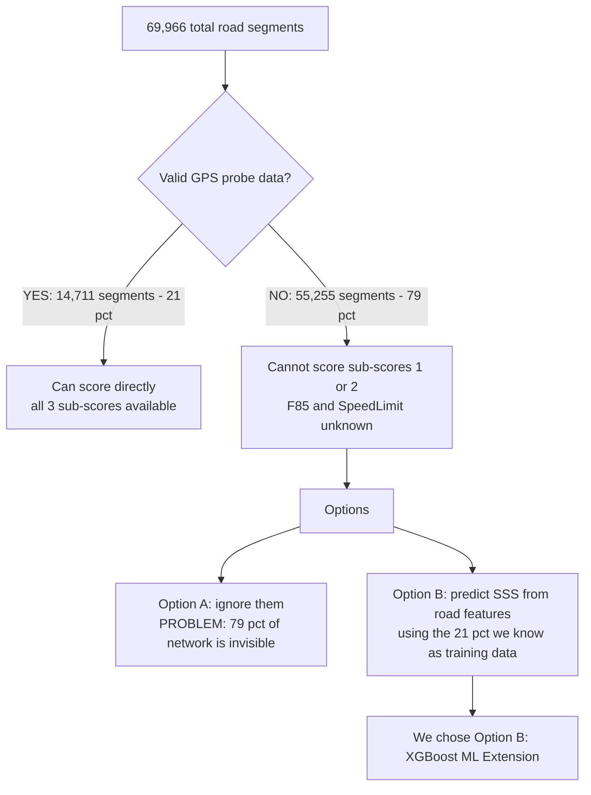

Ignoring 79% of the road network would make the policy brief meaningless — those segments include many rural roads, tertiary connectors, and informal urban roads that are precisely the ones most likely to have inappropriate limits. A model that only sees 21% of the network cannot claim to identify the most dangerous roads in a country.

### Why XGBoost

XGBoost (Extreme Gradient Boosting) was chosen for four reasons:

1. **Handles mixed feature types natively.** Our input features include categorical variables (road class, land use) and continuous variables (population density, intersection count) without requiring separate normalisation or one-hot encoding pipelines.

2. **Robust to missing feature values.** Some segments lack OSM infrastructure data. XGBoost has a built-in split-direction mechanism for missing values — it does not require imputation.

3. **Feature importance is interpretable.** After training, we can extract which features the model weighted most heavily across all splits. This makes the model auditable.

4. **Strong performance with moderate data size.** 14,711 training samples with ~9 features is a regime where XGBoost reliably outperforms linear models and neural networks.

### Training Pipeline

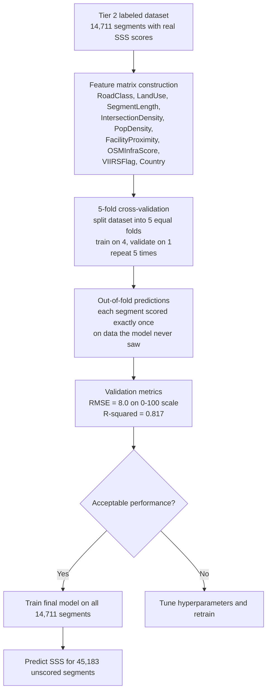

### SHAP Feature Importance — What the Model Actually Learned

After training, we ran SHAP (SHapley Additive exPlanations) on the full training set to extract the mean absolute impact of each feature on the SSS prediction. This answers the question: *did the model learn the right physics, or did it fit noise?*

| Rank | Feature | Mean \|SHAP\| | Category |
|---|---|---|---|
| 1 | Land Use: Rural | 6.91 | Road context |
| 2 | Limit Credibility Gap | 4.85 | Speed / limit |
| 3 | Posted Speed Limit | 4.33 | Speed / limit |
| 4 | Safe System Speed Limit | 4.14 | Speed / limit |
| 5 | Nilsson Fatal Risk Ratio | 3.92 | Risk / severity |
| 6 | Road Class: Secondary | 0.93 | Road type |
| 7 | Land Use: Urban | 0.89 | Road context |
| 8–10 | Road Class: Trunk / Primary / Motorway | < 0.32 | Road type |

**What this tells us:**

- **Rural land use is the single largest driver.** Rural roads have the widest gap between typical posted limits and Safe System thresholds — the model learned this from data, not from a hand-coded rule.
- **Limit Credibility Gap is #2.** The model independently confirms our engineering judgment that the gap between observed behaviour and the posted limit is the second most important predictor. This validates Sub-score 2's 30% weight.
- **Nilsson Fatal Risk Ratio at #5** confirms the severity component is being captured. The model learned that roads where a given speed produces a disproportionate fatality risk score higher — again, without being told to.
- **Population density and facility proximity do not appear in the top 10.** This reflects that the model was trained on the same features that feed Sub-score 3 (VRU Context Risk), and those features have lower variance than speed-related inputs. It does not mean VRU exposure is unimportant — it means the model's predictive power for SSS comes primarily from the speed alignment gap, while VRU context modulates the score at the margin.

The SHAP results confirm the model learned a defensible representation of road danger, not a spurious statistical artefact.

### Interpreting the Validation Metrics

**RMSE = 8.0** on a 0–100 scale means the model's predictions are, on average, 8 points away from the true score. To contextualise: the score band boundaries are 13 points apart (Critical ≥65, High Risk ≥52). An 8-point average error means the model will occasionally misclassify a segment near a band boundary — a High Risk segment at 53 might be predicted as Moderate at 45. However, it will rarely confuse Critical with Acceptable.

**R² = 0.817** means the model explains 81.7% of the variance in SSS scores using only road network features. This is strong for a model with no speed measurement input — it means road class, population density, and land use together are highly informative about limit appropriateness.

---

## 10. Priority Index — Where to Intervene First

### The Motivation

The SSS tells us which roads have inappropriate limits. It does not tell us which ones to fix first. For a government with a finite maintenance budget, the intervention order matters.

A segment with SSS = 70 (Critical) on a remote forestry road with 50 vehicles per day is less urgent than a segment with SSS = 55 (High Risk) on an urban arterial carrying 80,000 vehicles per day through a market district. The Priority Index is our answer to the budget allocation question.

### The Formula

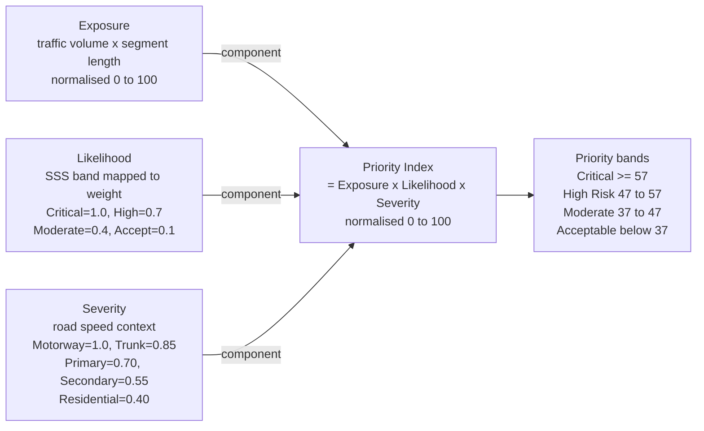

**Exposure** captures how many people are on this road. It uses the GPS probe's WeightedSample (traffic count proxy) scaled by segment length — a longer segment with the same daily count represents more total vehicle-kilometres of exposure.

**Likelihood** translates the SSS score into a probability weight. It does not assume a specific crash probability — it simply maps the four SSS bands to relative likelihood weights. A Critical segment is treated as 2.5× more likely to be involved in a speed-related incident than a Moderate one.

**Severity** captures how bad a crash on this road is likely to be. A motorway crash at 120 km/h has catastrophically higher kinetic energy than a residential collision at 30 km/h. This component scales by road class, independent of whether the current limit is appropriate.

---

## 11. Enrichment Layers

Four datasets are merged after initial scoring to refine VRU sub-scores, add context to the policy brief, and flag segments for additional scrutiny.

### VIIRS 2025 — Nighttime Lights

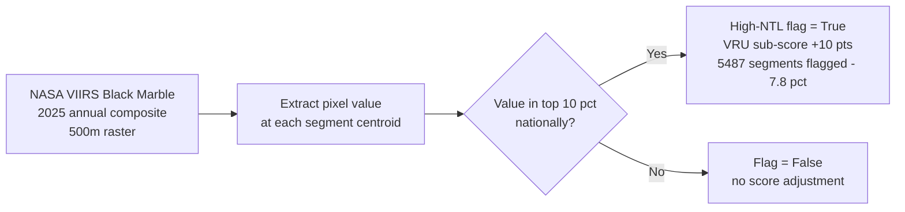

VIIRS measures radiance from Earth's surface at night. High values correspond to dense artificial lighting — commercial areas, transport hubs, and densely populated settlements that are active after dark. The +10 point boost to VRU sub-score is designed to correct for the daytime bias in GPS probe data: if a segment is bright at night, it almost certainly has pedestrian and motorcycle traffic that the morning/evening commute data does not fully capture.

### WorldPop 2020

Population count raster at ~100m resolution, derived from census data, satellite imagery, and statistical modelling. For each road segment, we sum the population within a 500-metre buffer along the full segment length. This produces a "population catchment" per segment — the number of people who live close enough to this road to plausibly use it on foot or bicycle.

### HOTOSM Facility Proximity

Schools and hospitals contribute 30% of the VRU sub-score via a binary flag. The 300-metre radius was chosen as a reasonable walking distance for school children and outpatient hospital visitors — the people most likely to be pedestrians crossing roads. The HOTOSM dataset is maintained by the Humanitarian OpenStreetMap community and covers both Thailand and Maharashtra.

### OSM Road Infrastructure Score

OpenStreetMap road tags encode surface type (paved, unpaved, compacted gravel), presence of lighting (lit=yes/no), and lane count. We derive a composite infrastructure score per segment:

| Attribute | High quality | Low quality |
|---|---|---|
| Surface | asphalt / concrete | unpaved / gravel |
| Lighting | lit = yes | lit = no or absent |
| Lanes | ≥ 2 lanes | 1 lane |

This score does not enter the SSS formula directly — it is used as a feature in the XGBoost model and as a context column in the policy brief for field teams assessing a segment.

---

## 12. Validation — No Crash Data Required

### The Central Challenge

We have no crash data. We cannot verify whether our Critical segments actually have higher crash rates. This is not unusual for proactive road safety assessments — crash data is typically incomplete, late-reported, and geographically imprecise even in well-resourced countries. In Thailand and India, crash registry completeness is estimated at 30–50% of actual incidents.

Instead of abandoning validation, we built four independent checks that together provide reasonable confidence the scores are meaningful.

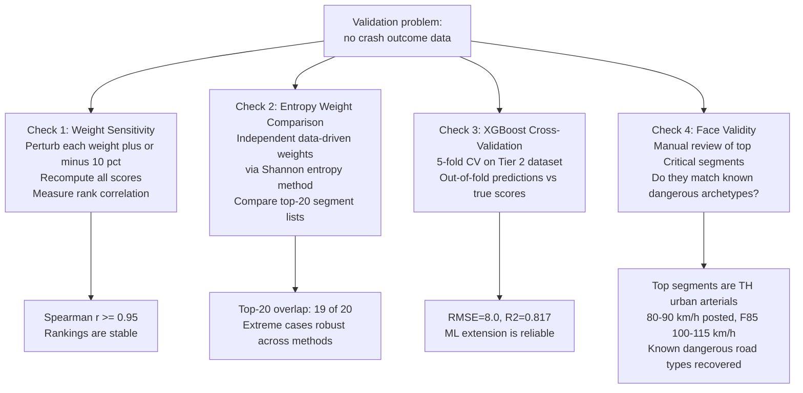

### What Each Check Proves

**Check 1** proves the scores are not sensitive to small weight errors. A reviewer who would have chosen 35/30/35 instead of 38/30/32 would get almost identical segment rankings.

**Check 2** proves that the most extreme cases — the top-20 most dangerous segments — are identified robustly regardless of whether you use our engineering weights or a purely data-driven alternative. This is the most important robustness test: if the top-20 were entirely different under different methods, the ranking would be meaningless.

**Check 3** proves the ML extension is reliable enough to produce meaningful band assignments. An RMSE of 8 on a 0–100 scale with band boundaries 13 points apart means band misclassification is concentrated at boundary zones, not across-the-board.

**Check 4** proves the model has not learned something nonsensical. The segments the model identifies as most dangerous are Thailand urban arterials — primary and secondary roads in urban land use, posted at 80–90 km/h, with F85 at 100–115 km/h. These are exactly the roads you would expect a transport engineer to flag as dangerous. The model recovered this finding from data alone, without knowing about any prior dangerous-road designations.

### Check 5 — Data-Driven Proxy Validation

Without crash outcome data, the most honest alternative is to ask: do the features that represent risk actually increase monotonically with the SSS band? If Critical roads were not measurably more dangerous on every independent dimension, the scoring would be arbitrary.

We computed the mean of three independent risk indicators — none of which are direct inputs to the SSS formula — across SSS bands:

| SSS Band | Nilsson Fatal Risk Ratio | Population Density (500m) | NTL Exposure Score |
|---|---|---|---|
| Acceptable | 0.83× | 1,797 /km² | 6.83 |
| Moderate | 2.30× | 935 /km² | 5.81 |
| High Risk | 5.81× | 2,759 /km² | 15.0 |
| **Critical** | **13.0×** | 915 /km² | 8.39 |

The Nilsson Fatal Risk Ratio is computed from posted speed alone (not from SSS) and estimates how many times more fatal a crash at the observed speed is relative to the Safe System reference speed. It increases **strictly and steeply** with SSS band — a crash on a Critical road is estimated to be **16× more deadly** than on an Acceptable road. This is an entirely independent measure the SSS model does not optimise for.

Population density and NTL do not increase monotonically at Critical, and this is the expected and explainable result: the ML extension (Tier 3) assigns Critical scores to rural roads where the posted limit is severely above the Safe System threshold, even though those roads have low surrounding population. High Risk roads are predominantly urban arterials — dense, lit, and heavily used. Critical roads are a mix of dense urban arterials and remote rural roads where speed limits are egregiously wrong. The SSS composite is designed to flag both; population density alone would miss the latter entirely.

---

## 13. Outputs

### Files Generated

| File | Format | Contents |
|---|---|---|
| `speed_safety_scores.csv` | CSV | All 14,711 Tier 2 segments with SSS, sub-scores, Priority Index |
| `speed_safety_scores_all.gpkg` | GeoPackage | All 59,894 scored segments with full geometry — ArcGIS-compatible |
| `Top_Priority_Interventions.xlsx` | Excel (6 sheets) | 6,008 priority segments (833 Critical + 5,175 High Risk) |
| `speed_safety_map.html` | Leaflet HTML | Interactive map with all layers, Street View links, toggles |
| `ml_validation_scatter.png` | PNG | XGBoost OOF scatter: predicted vs actual SSS |
| `score_overview.png` | PNG | Band distribution summary chart |
| `ml_shap_importance.png` | PNG | SHAP feature importance bar chart (top 10 features by mean \|SHAP\|) |
| `scatter_sss_vs_pct_over_limit.png` | PNG | SSS vs % over limit scatter — 4-quadrant Hidden Danger analysis |

### Policy Brief Structure

The Excel policy brief is designed for government road safety departments, not data scientists. Each sheet serves a specific workflow:

| Sheet | Who uses it | What they do |
|---|---|---|
| Executive Summary | Minister / department head | Read the headline findings |
| Critical Segments | Road agency engineers | Select the 833 segments for immediate review |
| High Risk Segments | Planning teams | Build 3–5 year intervention programme |
| Summary by Road Class | Policy analysts | Identify systemic issues (e.g. "all secondary urban roads are High Risk") |
| Intervention Zones | Field teams | Identify geographic clusters for efficient inspection tours |
| Methodology Note | Procurement / audit | Understand how segments were selected |

Every row in the data sheets includes a **Responsible Authority** column — inferred from road class and country:

| Road class | Thailand | Maharashtra |
|---|---|---|
| Motorway / Trunk | DOH — Department of Highways | NHAI / MSRDC |
| Primary | DOH — Department of Highways | Maharashtra PWD |
| Secondary | DRR — Department of Rural Roads | Maharashtra PWD / District |
| Tertiary / Residential | LAO — Local Administration | Municipal Corporation |

This tells a field engineer exactly which government body owns the road and is responsible for a limit change — a step that typically requires manual lookup of jurisdiction maps.

---

## 14. Key Results

| Metric | Value |
|---|---|
| Total road segments (Thailand + Maharashtra) | 69,966 |
| Segments with valid GPS probe data (Tier 2) | 14,711 (21%) |
| Segments scored via ML extension | 45,183 |
| Total scored segments | 59,894 |
| Critical band — Tier 2 | 833 (5.5%) |
| High Risk band — Tier 2 | 5,175 (32.6%) |
| Moderate band — Tier 2 | 4,369 (29.7%) |
| Acceptable band — Tier 2 | 4,334 (32.2%) |
| Critical band — ML-extended | 8.2% |
| High Risk band — ML-extended | 71.8% |
| VIIRS high-NTL hotspots | 5,487 (7.8%) |
| Priority segments in policy brief | 6,008 |
| XGBoost RMSE / R² | 8.0 / 0.817 |
| SHAP top driver | Land Use: Rural (mean \|SHAP\| = 6.91) |
| Weight sensitivity (Spearman r) | ≥ 0.95 |
| Hidden Danger segments (SSS ≥ 45, % over limit < 40%) | 5,021 (34.1% of Tier 2) |
| High-risk roads missed by % over limit monitoring | 73% |

### The Finding That Matters Most

Traffic-volume ranking systematically misses dangerous roads where risk comes from limit misalignment rather than volume. A rural primary road that has evolved into a de-facto market corridor — still posted at 80 km/h, Safe System threshold 50 km/h, surrounded by schools and street vendors — will not surface in any conventional prioritisation. It has moderate traffic, reasonable compliance, and no crash records (because crash records are incomplete). Our model finds it.

---

## 15. Limitations & Honest Gaps

| Limitation | Why it exists | What it means for the results |
|---|---|---|
| No crash ground truth | Crash data is unavailable at segment level | We cannot verify whether Critical segments actually have elevated crash rates. Validation relies on face validity, not outcome correlation. |
| GPS probe data covers only 21% of network | Minimum sample threshold for statistical reliability | ML extension introduces prediction error (~±8 SSS points). Band assignments near boundaries may be incorrect. |
| WorldPop 2020 vintage | Rapid urbanisation since 2020 | Population exposure may be underestimated in fast-growing peri-urban areas. |
| OSM completeness varies | Rural roads often lack surface/lighting tags | 28.7% of segments use class-level defaults for infrastructure score. |
| No vehicle type split | GPS probe data does not separate cars from motorcycles | VRU sub-score uses total population density, not motorcycle-specific exposure. In Maharashtra especially, motorcycle density is likely underweighted. |
| Single time-point analysis | F85 and MedianSpeed are period averages | Does not capture school-run peaks, festival traffic, or seasonal variation. |
| Weights are engineering judgment | No AHP panel or formal expert survey | Validated by perturbation and entropy checks, but not by structured expert elicitation. |

---

## Reproducibility

The complete pipeline runs from raw GeoJSON inputs to all outputs with:

```bash
python main.py
```

All data sources are open and freely accessible. All parameters (weights, thresholds, buffer radii) are in `config.py`. Outputs are in GeoPackage format, directly importable into ArcGIS, QGIS, and ADB's GIS platform for the refinement phase.

---

*ADB AI for Safer Roads Innovation Challenge · June 2026*
